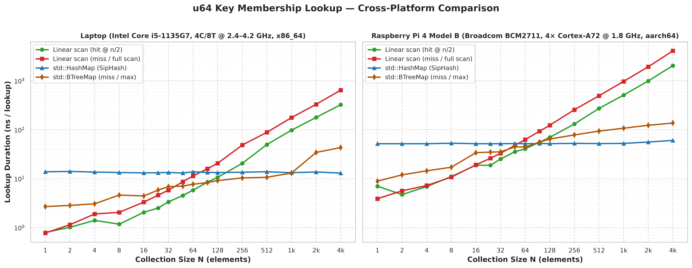
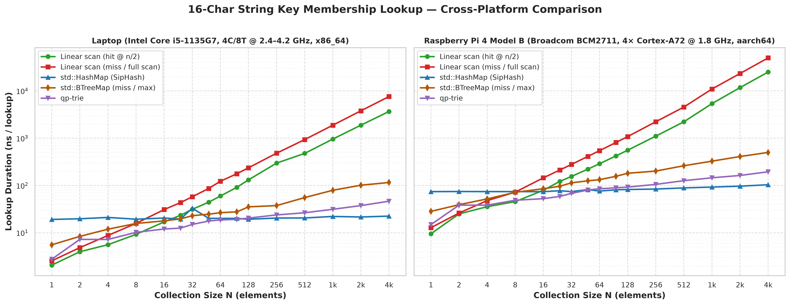
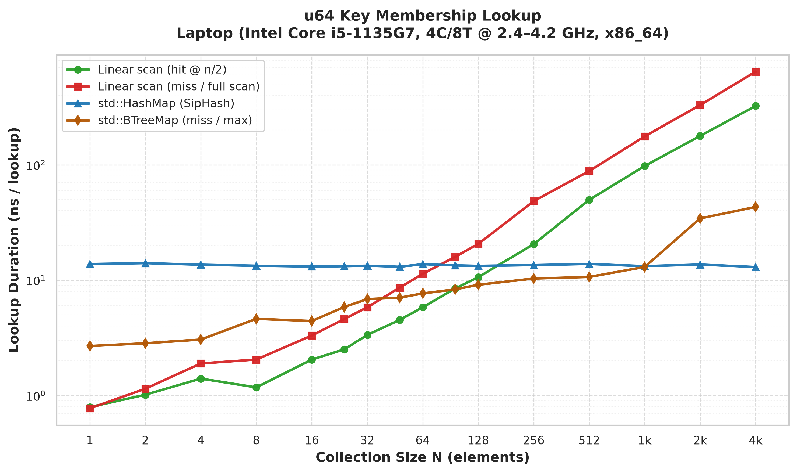
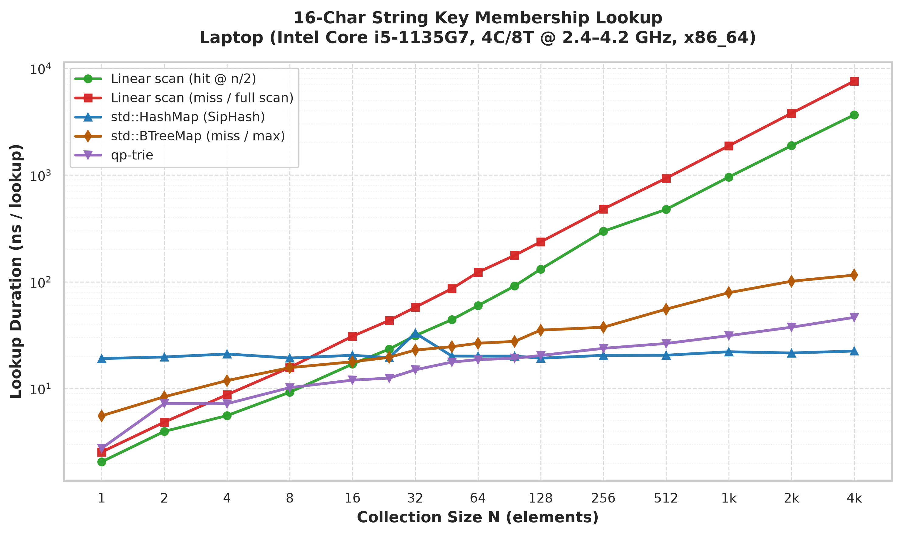
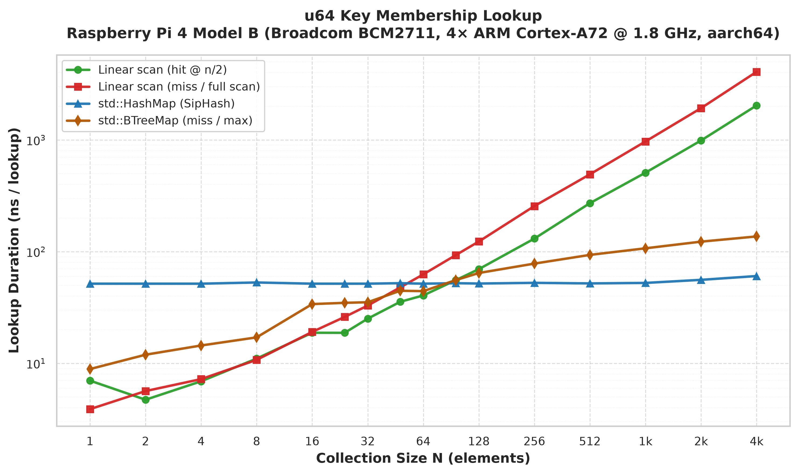
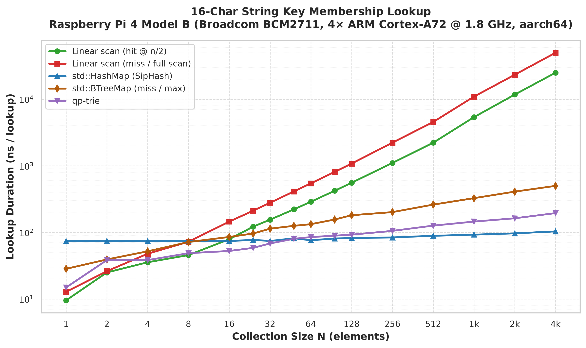

# When is a loop faster than a HashMap?

Looking up a key in a `HashMap` is *O(1)*. Scanning a `Vec` is *O(n)*.
For a large collection the map wins. For a **small** one, the loop often wins
anyway — hashing and pointer-chasing cost more than walking a few contiguous
words.

This crate measures that crossover across different CPU architectures:
- **Laptop**: Intel Core i5-1135G7 (4 cores / 8 threads @ 2.40–4.20 GHz, 8 MB L3, `x86_64`)
- **Raspberry Pi 4 Model B**: Broadcom BCM2711 (4× ARM Cortex-A72 @ 1.8 GHz, 1 MB L2, `aarch64`)

---

## Benchmark Hardware Specifications

| Specification | Laptop Host | Raspberry Pi 4 Model B |
|---|---|---|
| **SoC / CPU** | 11th Gen Intel Core i5-1135G7 | Broadcom BCM2711 |
| **Microarchitecture** | Willow Cove (`x86_64`) | ARM Cortex-A72 (`aarch64`) |
| **Cores / Threads** | 4 Cores / 8 Threads | 4 Cores / 4 Threads |
| **Base / Max Clock** | 2.40 GHz / 4.20 GHz Boost | 1.80 GHz Fixed |
| **Caches** | 192 KB L1d, 128 KB L1i, 5 MB L2, 8 MB L3 | 128 KB L1d, 192 KB L1i, 1 MB L2 |
| **Operating System** | Linux (Fedora 43, kernel 6.18, `x86_64`) | Raspberry Pi OS / Debian 13 Trixie (kernel 6.18, `aarch64`) |
| **Toolchain** | Rust 1.90.0 (native) | Rust 1.90.0 (`cargo-zigbuild` targeting glibc 2.28) |

---

## Cross-Platform Benchmark Results

### 1. `u64` Key Lookup



#### Platform Crossover Breakdown (`u64`):

| Target Platform | Linear Scan Hit (`linear_mid`) Beats HashMap Up To | Linear Scan Miss (`linear_max`) Beats HashMap Up To |
|---|---|---|
| **Laptop (Intel i5-1135G7)** | **N = 128** | **N = 64** |
| **Raspberry Pi 4 Model B (Cortex-A72)** | **N = 64** | **N = 48** |

---

### 2. 16-Character String Key Lookup



#### Platform Crossover Breakdown (Strings):

| Target Platform | Linear Scan (`linear_mid`) Fastest Up To | `qp-trie` Fastest In Range | `std::HashMap` Dominates At |
|---|---|---|---|
| **Laptop (Intel i5-1135G7)** | **N = 8** | **N = 16 .. 96** | **N ≥ 128** |
| **Raspberry Pi 4 Model B (Cortex-A72)** | **N = 8** | **N = 16 .. 48** | **N ≥ 64** |

---

## Detailed Platform Plots

### Laptop (Intel Core i5-1135G7, 4C/8T @ 2.4–4.2 GHz, x86_64)

<p align="center">
  
  
</p>

### Raspberry Pi 4 Model B (Broadcom BCM2711, 4× ARM Cortex-A72 @ 1.8 GHz, aarch64)

<p align="center">
  
  
</p>

---

## Run Locally

```bash
# Run benchmarks directly (outputs detailed tables, ASCII rankings, and CSVs)
cargo bench --bench ints
cargo bench --bench strings

# Regenerate high-resolution static PNG plots via matplotlib/seaborn
python3 scripts/plot_results.py
```

---

## Cross-Compile for Raspberry Pi 4

Cross-compilation targets stock 64-bit Raspberry Pi OS / Debian (`glibc`, dynamic linking):

```bash
# 1. Install toolchain target and cross-builder
rustup target add aarch64-unknown-linux-gnu
cargo install cargo-zigbuild

# 2. Cross-compile release benchmark binaries
cargo zigbuild --release --benches --target aarch64-unknown-linux-gnu.2.28

# 3. Copy binaries to Raspberry Pi and execute
scp target/aarch64-unknown-linux-gnu/release/deps/ints-* user@pi1:/tmp/ints
scp target/aarch64-unknown-linux-gnu/release/deps/strings-* user@pi1:/tmp/strings
ssh user@pi1 "BENCH_CSV_DIR=/tmp/rpi4 /tmp/ints && BENCH_CSV_DIR=/tmp/rpi4 /tmp/strings"
```

---

## What is timed

A collection of **N** random keys is built **once**, then we time a single
membership test (`contains` / `contains_key`). Insert/build cost is not in
the number.

| series | structure | probe |
| --- | --- | --- |
| `linear_mid` | `Vec` | key sitting at index `n/2` (typical hit) |
| `linear_max` | `Vec` | a key that is **not** there (full scan) |
| `hashmap` | `std::HashMap` | a present key, rotating so one hot key cannot win on prediction |
| `btree_max` | `std::BTreeMap` | rotating absent key (full depth / miss) |
| `trie` | `qp-trie` | strings only |

`HashMap` uses the default hasher (SipHash). A faster hasher would move its
win to smaller N. A binary heap is not a search tree, so it is not in the
plot — finding an arbitrary key in a heap is *O(n)* with worse locality than
`Vec`.

## How to read the plot

- **X** is N (log scale). **Y** is nanoseconds per lookup (log scale).
- The linear series climb with *O(n)*; HashMap stays roughly flat (*O(1)*).
- Trees climb with *O(log n)*, with `btree_max` (worst-case / absent key full depth search).
- Where they cross, the map starts to pay for itself.
- `linear_max` crosses first (a miss already scanned the whole array).
- `linear_mid` crosses later (a hit only walks half the array on average).

Expect HashMap to look *worse* than `Vec` and often `BTreeMap` at tiny N:
SipHash on a `u64` is real work, and the table is not as cache-friendly as a
short array.

## Why the loop is fast when N is small

A `Vec` is one contiguous block. The CPU fetches it in cache-line-sized
chunks and can compare several keys before RAM is involved again. A HashMap
must hash the key, then jump to a slot that may not be in cache. That
overhead is roughly constant; the scan’s cost grows with N. At some N the
lines meet.

Strings add a wrinkle: comparing two strings can stop at the first mismatch,
while HashMap still hashes the whole key. The trie walks byte-by-byte and
can beat HashMap in a middle band of N.

## AI usage disclosure

this project was generated with Grok 4.6 (High)
